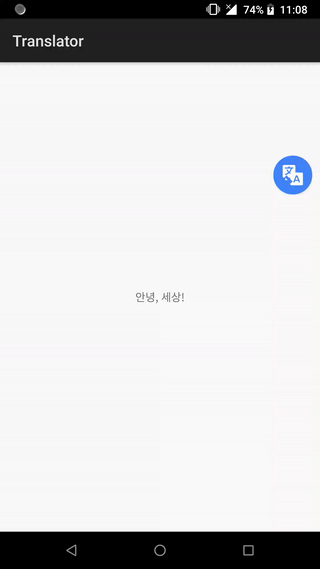

# translator

Translator is an Android library for in-app UI translation, it uses [ML Kit Text Translation](https://developers.google.com/ml-kit/language/translation) which powered by Google team.



## Getting Started

```gradle
dependencies {
    implementation "io.johnsonlee.translate:translator:1.0.0"
}
```
